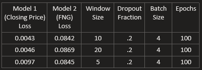

# LSTM Stock Predictor

Due to the volatility of cryptocurrency speculation, investors will often try to incorporate sentiment from social media and news articles to help guide their trading strategies. One such indicator is the [Crypto Fear and Greed Index (FNG)](https://alternative.me/crypto/fear-and-greed-index/) which attempts to use a variety of data sources to produce a daily FNG value for cryptocurrency. You have been asked to help build and evaluate deep learning models using both the FNG values and simple closing prices to determine if the FNG indicator provides a better signal for cryptocurrencies than the normal closing price data.

In this assignment, you will use deep learning recurrent neural networks to model bitcoin closing prices. One model will use the FNG indicators to predict the closing price while the second model will use a window of closing prices to predict the nth closing price.

- - -
## Concepts

* Recurrent Neural Network (RNN)
    * Class of artificial neural networks where connections between nodes form a directed graph along a temporal sequence. 
    * This allows it to exhibit temporal dynamic behavior.
    * Derived from feedforward neural networks
    * RNNs can use their internal state (memory) to process variable length sequences of inputs
* Long short-term memory (LSTM) 
    * RNN
    * Unlike standard feedforward neural networks, LSTM has feedback connections
    * It can not only process single data points (such as images), but also entire sequences of data (such as speech or video).
    * A common LSTM unit is composed of a cell, an input gate, an output gate and a forget gate. 
    * The cell remembers values over arbitrary time intervals and the three gates regulate the flow of information into and out of the cell.
    * Well-suited to classifying, processing and making predictions based on time series data.

- - -
## Files

[Closing Prices - Analysis](lstm_stock_predictor_closing.ipynb)

[FNG - Analysis](lstm_stock_predictor_fng.ipynb)

- - -

## Model Params

* Dropout fraction: 20%
* Batch size: 4
* Epochs: 100
* Window size: 10

- - -
## Questions and Answers

 

* <strong>Question:</strong> Which model has a lower loss?
* <strong>Answer:</strong> The model based on closing price had a consistently lower loss accross all parameter combinations tested.

 

* <strong>Question:</strong> Which model tracks the actual values better over time?
* <strong>Answer:</strong> It is very clear closing prices track actual values better over time.

 

* <strong>Question:</strong> Which window size works best for the model?
* <strong>Answer:</strong> I found that a window size of 10 produced the lowest loss.

 

- - -

