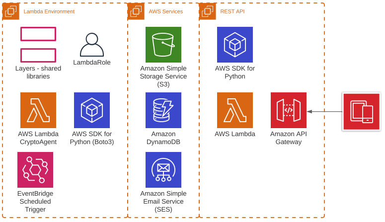

# Crypto Adviser: Agent to the Moon

### Team Members 
* Brian Hampson

 

- - -

 

# Project Description and Objectives

 

The objective of this project is to build a cryptocurrency notification agent that will continuously monitor OHLCV data and trigger alerts when common market indicators exceed configurable thresholds. When an alert is triggered, various ML models (LSTM RNN, Linear Regression, and GARCH) will be employed to predict future price action . Additionally, NLP will be leveraged to perform sentiment analysis on recent news articles. Resultant data will be summarized and then emailed or text messaged to subscribed recipients.

 

- - -

 

# Files

 

### Presentation
* [Class Presentation PDF](crypto_advistor_presentation.pdf)

### Google Colab
* [Crypto OHLCV Data Prep](colab_crypto_ohlcv.ipynb)
* [Price Prediction Models](colab_price_prediction_models.ipynb)
* [Crypto Sentiment Analysis Data Prep](colab_sentiment_analysis.ipynb)
* Notes: will not run outside of Google Colab, dependency on .env file and mounted drive

### AWS Lambda
* [Crypto Advisor Agent - Lambda Function](lambda_function.py)
* Dependencies: 
    * environment variables
    * S3 bucket config
    * lambda execution role with specific privaledges
    * laybda layer with packages for CCXT, Numpy, Pandas

### AWS Lambda Dependencies
* [Package Dependencies - Lambda Layer](python.zip)

### Test Data
* [BTC OHLCV Local Cache](data/btc_ohlcv_cache.csv)
* [Email HTML Template](email_template.html)

 

- - -

 

# AWS Serverless Architecture

 

 

- - -

# Data Sources

* Crypto OHLCV - CCXT SDK - Kraken Exchange
* News headlines - News API

 

- - -

 

# Machine Learning Models

* LSTM RNN (completed)
* Linear Regression (completed)
* GARCH (planned)
* nltk.sentiment.vader SentimentIntensityAnalyzer (completed)
* word cloud (planned)

 

- - -

 

# Notification Triggers - Technical Indicators

* Exponentially Weighted Moving Average (EWMA) (completed)
* Bollinger Bands (completed)
* Relative Strength Index (RSI) (planned)
* Fibonacci Retracements (planned)
* Moving Average Convergence and Divergence (MACD) (planned)
* Average Directional Index (planned)
* On-Balance Volume (OBV) (planned)

 

- - -

 

# Task Breakdown

* setup git repo
* initial project planning, readme
* investigation
    * data sources
    * machine learning models
    * trading signals
* high level architecture and design
* models - using google colab
    * for each model
        * clean data
        * build and train
        * back-testing
        * save model on S3
* lambda development
    * lambda security, roles and permissions        
        * IAM app user
        * S3 read/write access
    * logging
    * read agent config from S3
    * read model from S3
    * run lambda on schedule
    * OHLCV - data caching - optimize data calls, ensure sufficient historical data
    * fetch and clean data
    * evaluate trading signals
    * run ML models, make predictions
    * plots and graphs (save to S3, access from email)
    * summarize results
    * send email
    * build email html template
* Configure S3 storage 
* Configure AWS SES
    * Register AWS domain on Route53
* build presentation
* finalize readme

 

## Next steps
* build package dependency layer for Keras and Tensor flow
* load models in lambda
* persistant storage - DynamoDB
    * tables
        * agent
            * alerts
            * triggers
        * openTrades
        * completedTrades
* REST API to encapsulate data calls and updates to DynamoDB
* web dashboard

 

- - -

 

# Summary
* AWS serverless architecture for the WIN!
* Achieved end-to-end solution that is both extensible and scalable (and secure)
* Platform for future development.
* Pain points / lessons learned:
* Difficulties importing Keras and TensorFlow.
* Use Docker containers for build dependencies.

