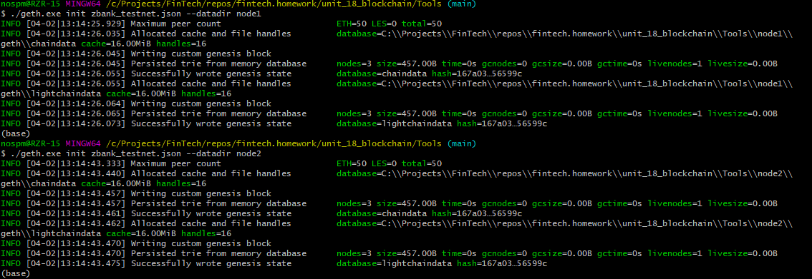
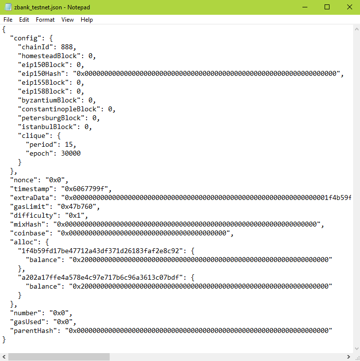
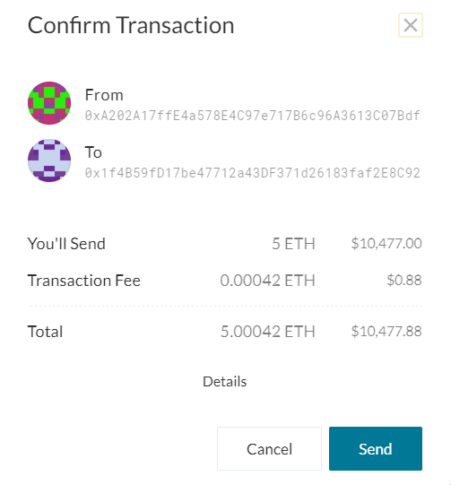
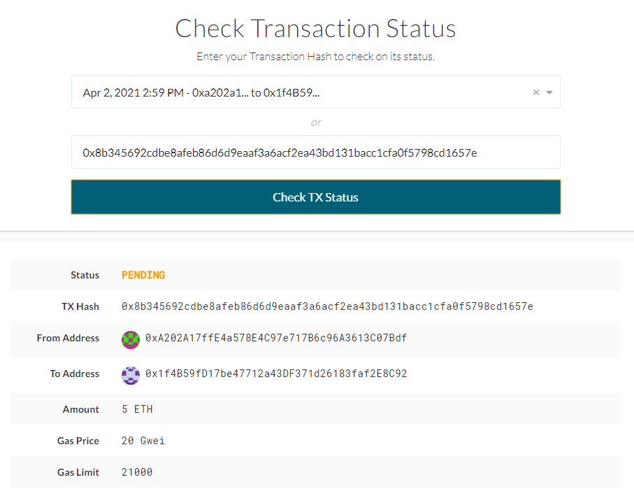

# ZBank - Ethereum Proof of Authority TestNet


<br>

## Configuration

<br>

### Genesis Block
* name: zbank_testnet
* id: 888
* consensus: Clique (Proof of Authority)
* password: none
* blocktime: 15m

### Node 1
* name: node1
* pubkey: 0xA202A17ffE4a578E4C97e717B6c96A3613C07Bdf
* desc: miner, running RPC, port 30303

### Node 2
* name: node2
* pubkey: 0x1f4B59fD17be47712a43DF371d26183faf2E8C92
* desc: miner, port 30304

<br><br>

## Files

<br>

* [Configuration - zbank_testnet.json](Tools/zbank_testnet.json)

<br><br>

## Steps to Run

<br>

1) Run node 1

    ```
    ./geth.exe --datadir node1 --unlock "0xA202A17ffE4a578E4C97e717B6c96A3613C07Bdf" --mine --rpc --allow-insecure-unlock
    ```

2) Run node 2

    ```
    ./geth.exe --datadir node2 --unlock "0x1f4B59fD17be47712a43DF371d26183faf2E8C92" --mine --port 30304 --bootnodes "enode://5227a0308f3cf4cec113e7c21529995298db0d5fc867c41cb63c8344bcf5de7dd64f2e8f5dca26684f441a9c50c4735ada368af5ccb3cd784761097f1041ce70@127.0.0.1:30303" --ipcdisable --allow-insecure-unlock
    ```

<br><br>

## Installation Process

<br>

1) Create accounts

    ```
    ./geth.exe account new --datadir node1
    ./geth.exe account new --datadir node2
    ```
    * NOTE: no pw set

    

<br>

2) Generate genisis block and write config

    ```
    ./puppeth.exe
    ```
    * Follow wizzard using config above
    * When complete, write config


<br>

3) Initialize nodes with genesis config

    ```
    ./geth.exe init zbank_testnet.json --datadir node1
    ./geth.exe init zbank_testnet.json --datadir node2
    ```



<br>

4) Run nodes
    * See <i>Steps to Run</i> above


<br><br>

## Testing

<br>

1) Open node1 wallet using keystore

    

2) Initiate transaction from node1 to node2

    

3) Transaction status

    

<br>

