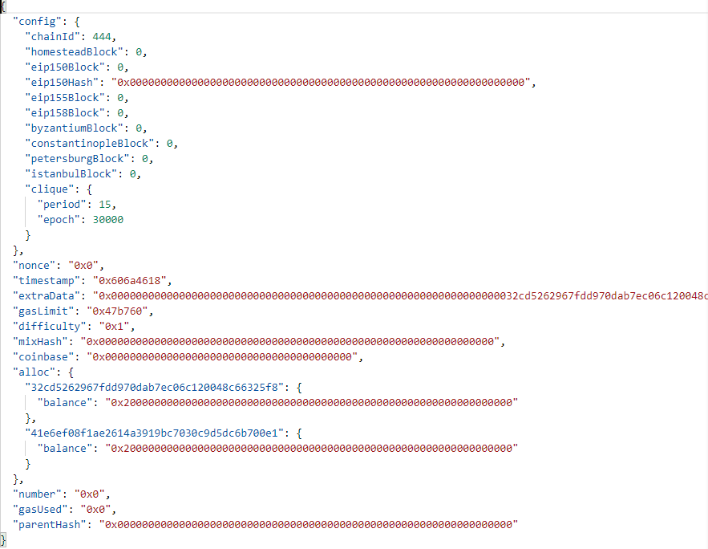
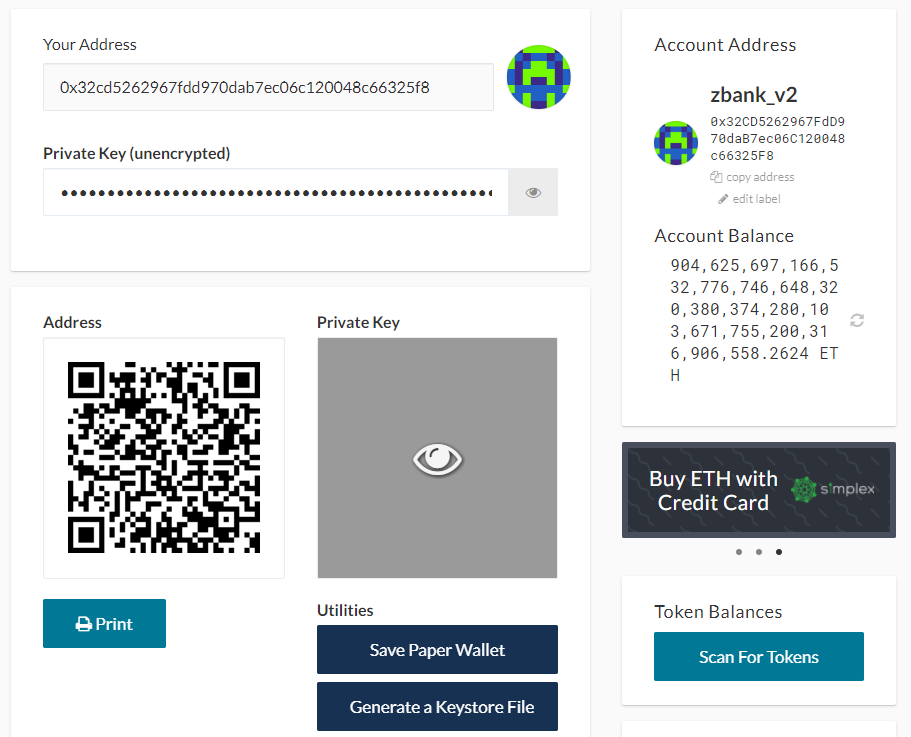
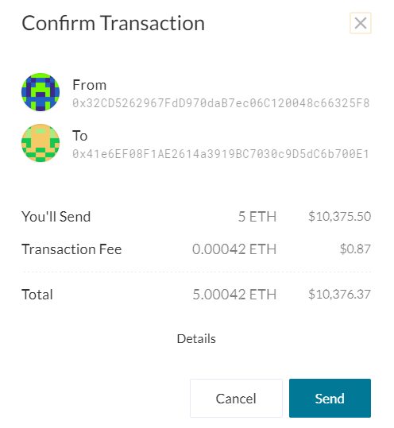
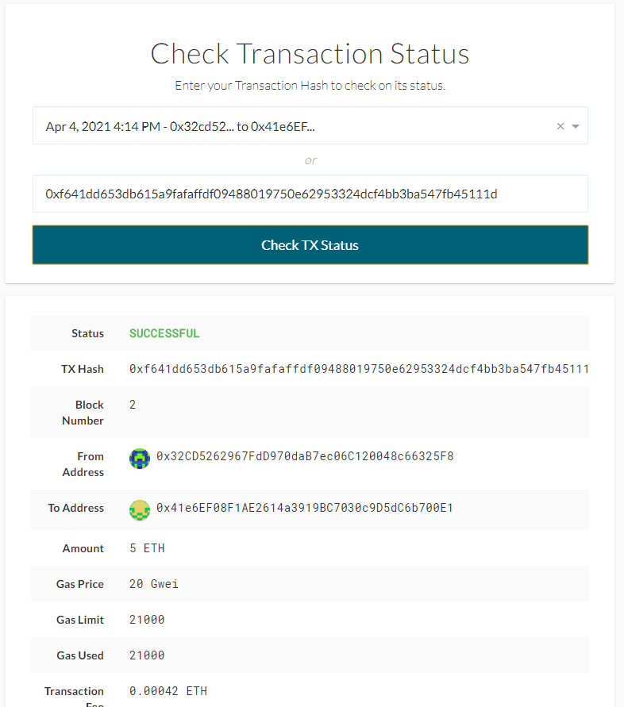

# ZBank - Ethereum Proof of Authority TestNet


<br>

## Configuration

<br>

### Genesis Block
* name: zbank_testnet_v2
* id: 444
* consensus: Clique (Proof of Authority)
* password: none
* blocktime: 15s

### Node 1
* name: node1
* address: 0x32CD5262967FdD970daB7ec06C120048c66325F8
* desc: miner, running RPC, port 30303

### Node 2
* name: node2
* address: 0x41e6EF08F1AE2614a3919BC7030c9D5dC6b700E1
* desc: miner, port 30304

<br><br>

## Files

<br>

* [Configuration - zbank_testnet_v2.json](Tools_v2/zbank_testnet_v2.json)

<br><br>

## Steps to Run

<br>

1) Run node 1

    ```
    ./geth.exe --datadir node1 --unlock "0x32CD5262967FdD970daB7ec06C120048c66325F8" --mine --rpc --allow-insecure-unlock
    ```

2) Run node 2

    ```
    ./geth.exe --datadir node2 --unlock "0x41e6EF08F1AE2614a3919BC7030c9D5dC6b700E1" --mine --port 30304 --bootnodes "enode://f044995cdf14a36fde0c75a8d67cc36009834e769182f39bb52bc773fa7a750caeaac0576642f8be7dec024730f75dd232275ef92d84180bdfc1d0c209e7a330@127.0.0.1:30303" --ipcdisable --allow-insecure-unlock
    ```

<br><br>

## Installation Process

<br>

1) Create accounts

    ```
    ./geth.exe account new --datadir node1
    ./geth.exe account new --datadir node2
    ```
    * NOTE: no pw set

<br>

2) Generate genisis block and write config

    ```
    ./puppeth.exe
    ```
    * Follow wizzard using config above
    * When complete, write config

    

<br>

3) Initialize nodes with genesis config

    ```
    ./geth.exe init zbank_testnet_v2.json --datadir node1
    ./geth.exe init zbank_testnet_v2.json --datadir node2
    ```

<br>

4) Run nodes
    * See <i>Steps to Run</i> above


<br><br>

## Testing

<br>

1) Open node1 wallet using keystore

    

2) Initiate transaction from node1 to node2

    

3) Transaction status

    

<br>

