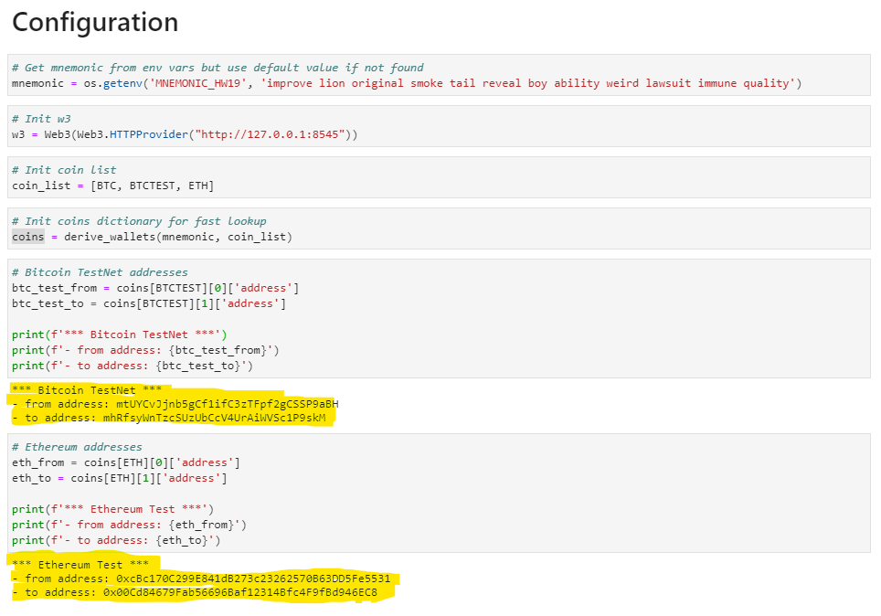
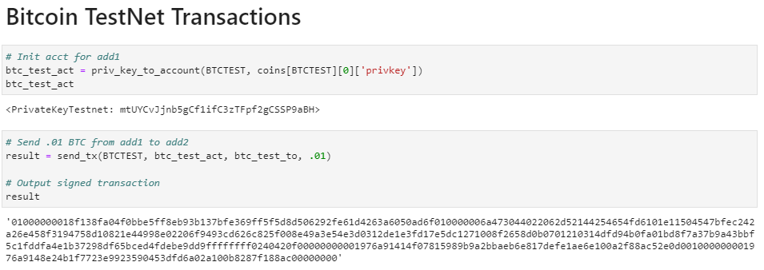
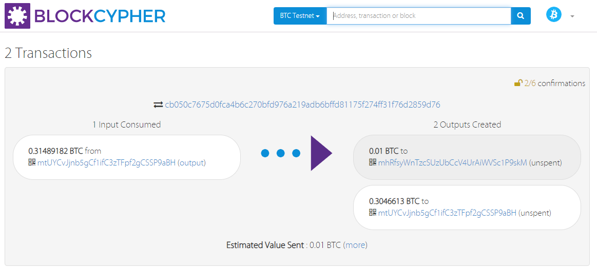
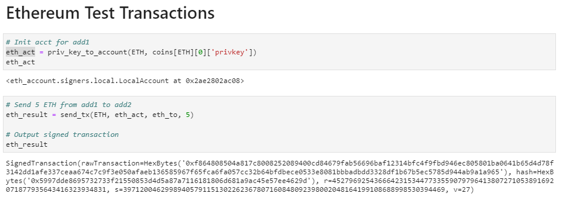
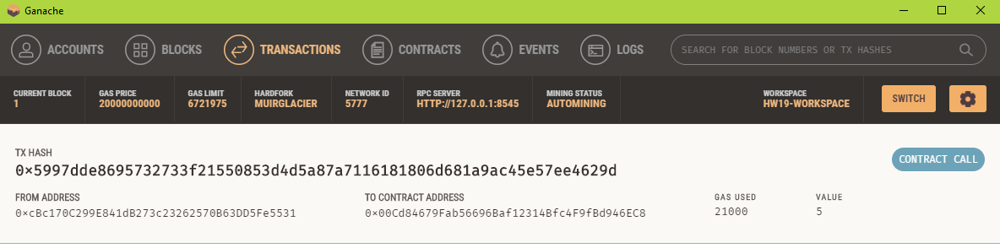

# Multi-Blockchain Wallet in Python

<br>

## Summary

<br>

This command line tool leverages hd-wallet-derive to derive addresses for ETH and BTCTEST using BIP44. A coins collection is pre-populated with addresses (and related information) and is made available for convenience. Methods are provided to initialize accounts and send transactions.

Methods:
* priv_key_to_account(coin, priv_key)
* send_tx(coin, account, to, amount)

<br><br>

## Files

<br>

* [Command line tool - wallet.py](wallet/wallet.py)
* [Example usage and testing notebook - wallet.ipynb](wallet/wallet.ipynb)
* [Dependency installation instructions - instructions.txt](instructions.txt)

<br><br>

## Usage

<br>

1) Open command line and start REPL (navigate to directory containing wallet.py)
    ````
    python
    ````
2) Import functions
    ```
    from wallet import *
    ```
3) Initialize account from private key (using coins collection)
    ```
    btc_test_act = priv_key_to_account(BTCTEST, coins[BTCTEST][0]['privkey'])
    ```
3) Send transaction
    ```
    result = send_tx(BTCTEST, btc_test_act, btc_test_to, .01)
    ```
<br><br>

## Testing

<br>

<strong>Configuration</strong>
* test mnumonic used for transactions
* test addresses used for transactions

* 


<strong>Transaction 1: Send .01 BTC from add1 to add2</strong>

* 

<strong>Confirmation using BlockCypher</strong>

* 

<br>

<strong>Transaction 2: Send 5 ETH from add1 to add2</strong>

* 

<strong>Confirmation using Ganache</strong>

* 


