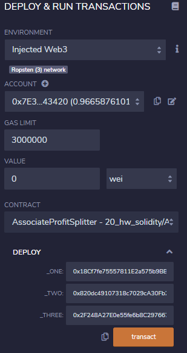
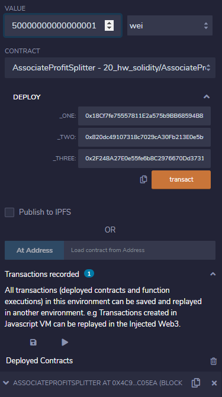
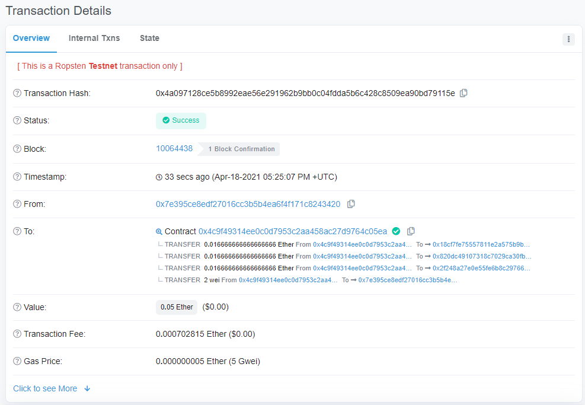
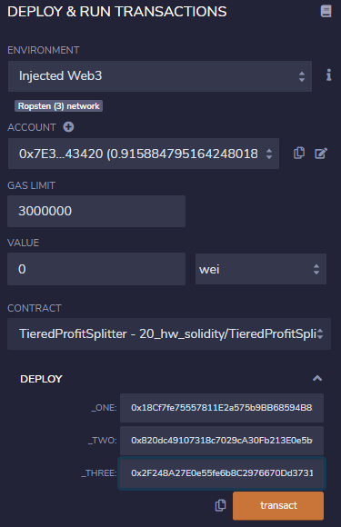
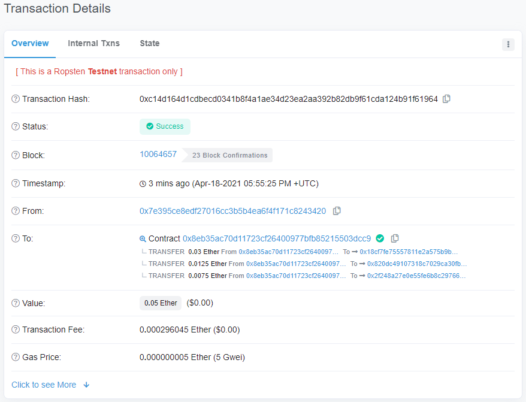

# Unit 20 - "Looks like we've made our First Contract!"

 

## Background

 

Your new startup has created its own Ethereum-compatible blockchain to help connect financial institutions, and the team wants to build smart contracts to automate some company finances to make everyone's lives easier, increase transparency, and to make accounting and auditing practically automatic!

Fortunately, you've been learning how to program smart contracts with Solidity! What you will be doing this assignment is creating 3 `ProfitSplitter` contracts. These contracts will do several things:

* Pay your Associate-level employees quickly and easily.

* Distribute profits to different tiers of employees.

* Distribute company shares for employees in a "deferred equity incentive plan" automatically.

- - - 

  

## Submission Notes

 

* <strong>NOTE: Submission instructions pasted below. This DOES NOT require separate Github repository, simply that we submit README.md in (existing and reused) Github repository!</strong>

* Create a README.md that explains how each of the contracts work and what the motivation for each of the contracts is. 

* Also, please provide screenshots to illustrate the functionality (e.g. how you send transactions, how the transferred amount is then distributed by each of the contracts, and how the timelock functionality can be tested with the fastforward function). 

* Alternatively, you can also record your interactions with the contract as a gif (e.g. https://www.screentogif.com/)

* Upload the README.md to a Github repository and provide the testnet address for others to interact with the contract.

- - - 

  

## Level One: The AssociateProfitSplitter Contract

 

<strong>Summary</strong>

This contract will accept Ether and divide the Ether evenly among the associate level employees. This will allow the Human Resources department to pay employees quickly and efficiently.

 

<strong>Files</strong>
* [AssociateProfitSplitter.sol](contracts/AssociateProfitSplitter.sol)

 

<strong>Example Usage</strong>

1) Deploy contract to Ropsten (using zero value)

    * 

    * Contract owner address:   0x7E395CE8edf27016cc3b5b4EA6F4f171C8243420
    * Contract address:         0x4c9f49314EE0C0D7953C2Aa458AC27D9764C05EA
    * Employee 1 address:       0x18Cf7fe75557811E2a575b9BB68594B85a994a3E
    * Employee 2 address:       0x820dc49107318c7029cA30Fb213E0e5b0f51AF3e
    * Employee 3 address:       0x2F248A27E0e55fe6b8C2976670Dd3731970F1630

 

2) Deposit 0.050000000000000001 ETH (50000000000000001 wei)

    * 

 

3) Verify transaction

    * We can see that for a deposit of 0.050000000000000001 ETH (50000000000000001 wei), we have evenly distributed 0.016666666666666666 ETH to each account
    * Employee address balances reflect deposit
    * https://ropsten.etherscan.io/tx/0x4a097128ce5b8992eae56e291962b9bb0c04fdda5b6c428c8509ea90bd79115e

    * 

  

- - - 

## Level Two: The TieredProfitSplitter Contract

 

<strong>Summary</strong>

This contract will accept Ether and distribute to employees based on tier/level. For example, the CEO gets paid 60%, CTO 25%, and Bob gets 15%.

 

<strong>Files</strong>
* [TieredProfitSplitter.sol](contracts/TieredProfitSplitter.sol)

 

<strong>Example Usage</strong>

1) Deploy contract to Ropsten (using zero value)

    * 

    * Contract owner address:   0x7E395CE8edf27016cc3b5b4EA6F4f171C8243420
    * Contract address:         0x8eB35ac70D11723cF26400977Bfb85215503DCc9
    * Employee 1 address:       0x18Cf7fe75557811E2a575b9BB68594B85a994a3E
    * Employee 2 address:       0x820dc49107318c7029cA30Fb213E0e5b0f51AF3e
    * Employee 3 address:       0x2F248A27E0e55fe6b8C2976670Dd3731970F1630

 

2) Deposit 0.050000000000000001 ETH (50000000000000001 wei)

    * 

 

3) Verify transaction

    * We can see that for a deposit of 0.050000000000000001 ETH (50000000000000001 wei), we have distributed ETH to employees in a tiered manor:
        * Employee 1: 0.03 ETH (60% of .05 ETH)
        * Employee 2: 0.0125 ETH (25% of .05 ETH)
        * Employee 3: 0.0075 ETH (15% of .05 ETH)
    * Employee address balances reflect deposit
    * https://ropsten.etherscan.io/tx/0xc14d164d1cdbecd0341b8f4a1ae34d23ea2aa392b82db9f61cda124b91f61964

    * 

  

- - - 

## Level Three: The DeferredEquityPlan Contract

 

<strong>Summary</strong>

This contract, modeling traditional company stock plans, will automatically manage 1000 shares with an annual distribution of 250 over 4 years for a single employee.

 

<strong>Files</strong>
* [DeferredEquityPlan.sol](contracts/DeferredEquityPlan.sol)

 

<strong>Example Usage</strong>

Was receiving gas errors, simply ran out of time before I could resolve.