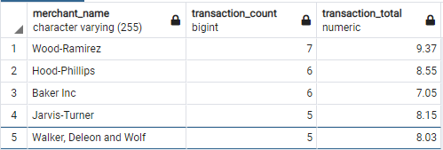
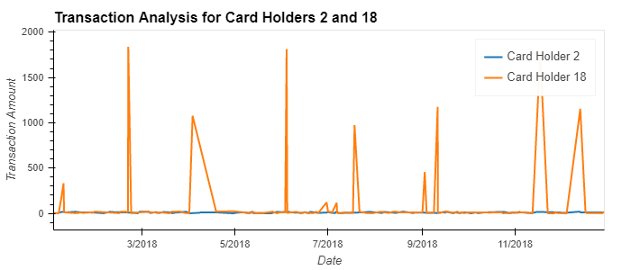
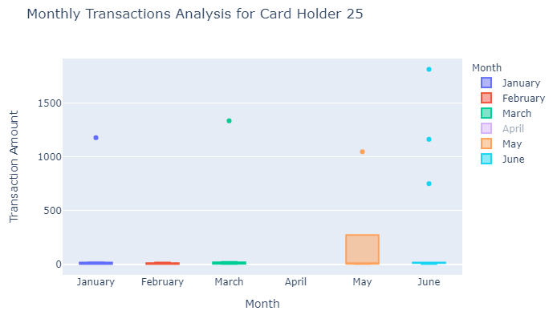

# Unit 7 Homework Assignment: Looking for Suspicious Transactions

## Supporting Files
* [ERD.png](./ERD.png): ERD - Physical Model Design
* [schema.sql](./schema.sql): DB Schema
* [queries.sql](./queries.sql): SQL Queries for Part 1 - Data Analysis

<br>

## Data Analysis - Part 1:

<br>

* <strong>Question:</strong> Is there any evidence to suggest that a credit card has been hacked?
* <strong>Answer:</strong>

    ```
    SELECT card_holder.card_holder_id, card_holder.name, COUNT(credit_card.card) AS "Transaction Count"
    FROM card_holder
    INNER JOIN credit_card ON card_holder.card_holder_id = credit_card.card_holder_id
    INNER JOIN transaction as t ON credit_card.card = t.card
    WHERE t.amount < 2.00
    GROUP BY card_holder.card_holder_id, card_holder.name
    ORDER BY "Transaction Count" DESC, card_holder.name
    ```

    If it is true that "some fraudsters hack a credit card by making several small transactions" (under $2), then we can clearly see several individuals who raise suspicion and warrant further investigation.

<br>

* <strong>Question:</strong> What are the top 100 highest transactions made between 7:00 am and 9:00 am? Do you see any anomalous transactions that could be fraudulent?
* <strong>Answer:</strong>

    ```
    -- Order by transaction amt and select top 100
    SELECT card_holder.name, credit_card.card, t.date, EXTRACT(HOUR FROM date) AS "date_hour", t.amount
    FROM card_holder
    INNER JOIN credit_card ON card_holder.card_holder_id = credit_card.card_holder_id
    INNER JOIN transaction as t ON credit_card.card = t.card
    WHERE EXTRACT(HOUR FROM date) >= 7 AND EXTRACT(HOUR FROM date) < 9
    ORDER BY t.amount DESC, card_holder.name
    LIMIT 100
    ```

    * To be honest, I don't follow the logic here. First we are saying fraudulant tranactions are likely to be under $2, now we are looking for "top highest"? This question does not make sense to me.


<br>

* <strong>Question:</strong> Is there a higher number of fraudulent transactions made during this time frame versus the rest of the day? Explain why you think there might be fraudulent transactions during this time frame.
* <strong>Answer:</strong>

    * The following SQL identifies all transactions under $2 and includes calculated columns identifying transaction as either within window or outside window.

    * Of the 350 transactions, only 30 are within 7-9am window. The majority lie outside the window.

    * Fradulant transactions likely lie within the 7am-9am window so that they are more difficult to distinguish from legitimate tranactions and more closely match typical spending patterns. This is the time must people are buying morning coffee or breakfast.

    ```
    SELECT 
        t.transaction_id, t.date, 
        EXTRACT(HOUR FROM date) AS "date_hour", 
        (EXTRACT(HOUR FROM date) >= 7 AND EXTRACT(HOUR FROM date) < 9) AS "7_to_9",
        (EXTRACT(HOUR FROM date) < 7 OR EXTRACT(HOUR FROM date) >= 9) AS "outside_window",
        t.amount, t.card, ch.name, m.merchant_name	
    FROM transaction as t
    INNER JOIN credit_card as c ON c.card = t.card
    INNER JOIN card_holder as ch ON ch.card_holder_id = c.card_holder_id
    LEFT JOIN merchant as m ON t.merchant_id = m.merchant_id
    WHERE amount < 2.00
    ORDER BY "7_to_9" DESC, m.merchant_name
    ```
<br>

* <strong>Question:</strong> What are the top 5 merchants prone to being hacked using small transactions?
* <strong>Answer:</strong>

    ```
    -- Group and sort by merchant
    SELECT 
        m.merchant_name, 
        COUNT(transaction_id) AS "transaction_count", 
        SUM(t.amount) AS "transaction_total"
    FROM transaction as t
    INNER JOIN credit_card as c ON c.card = t.card
    INNER JOIN card_holder as ch ON ch.card_holder_id = c.card_holder_id
    LEFT JOIN merchant as m ON t.merchant_id = m.merchant_id
    WHERE amount < 2.00
    GROUP BY m.merchant_name
    ORDER BY "transaction_count" DESC, "transaction_total" DESC
    LIMIT 5
    ```

    

<br>

## Data Analysis - Part 2:

<br>

* <strong>Question:</strong>What difference do you observe between the consumption patterns? Does the difference suggest a fraudulent transaction?
* <strong>Answer:</strong>

    * As we can see from the chart below...

        

<br>

* <strong>Question:</strong>Are there any outliers for cardholder ID 25? How many outliers are there per month?
* <strong>Answer:</strong>

    * As we can see from the chart below...

        


<br>

* <strong>Question:</strong>Do you notice any anomalies? Describe your observations and conclusions.
* <strong>Answer:</strong>